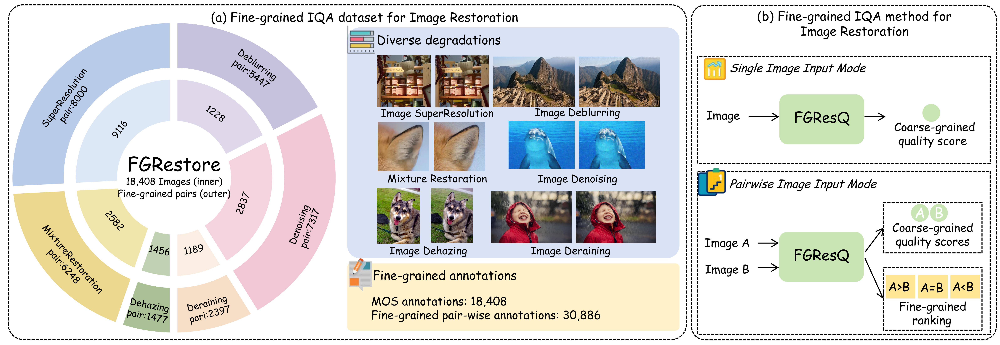
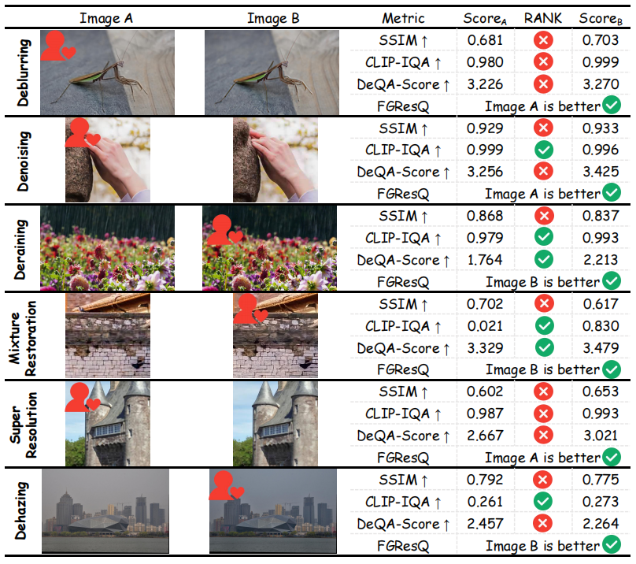
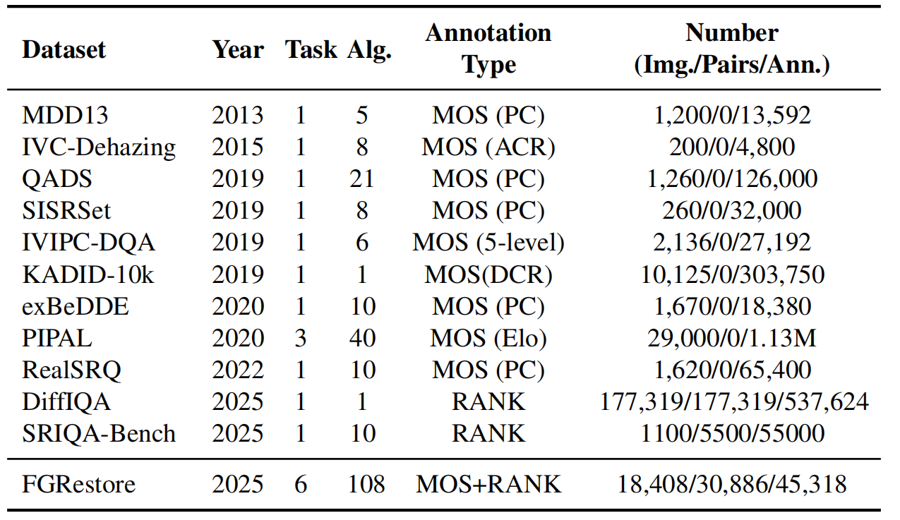
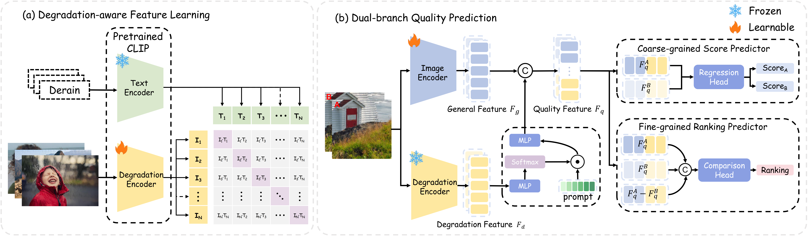

<h1 align="center">Fine-grained Image Quality Assessment for Perceptual Image Restoration</h1>

<div align="center">
    <a href="https://github.com/sxfly99">Xiangfei Sheng</a><sup>1*</sup>,
    <a href="https://github.com/pxf0429">Xiaofeng Pan</a><sup>1*</sup>,
    <a href="https://github.com/yzc-ippl">Zhichao Yang</a><sup>1</sup>,
    <a href="https://faculty.xidian.edu.cn/cpf/">Pengfei Chen</a><sup>1</sup>,
    <a href="https://web.xidian.edu.cn/ldli/">Leida Li</a><sup>1#</sup>
</div>

<div align="center">
  <sup>1</sup>School of Artificial Intelligence, Xidian University
</div>

<div align="center">
<sup>*</sup>Equal contribution. <sup>#</sup>Corresponding author. 
</div>

这篇中文介绍旨在让更多人了解我们组的最新工作，希望更多的小伙伴关注到这篇工作！！！

<div align="center">
  
</div>

##
# 图像恢复质量评估的挑战 &nbsp;<a href=""></a>
当图像恢复算法让雾气变通透、雨丝变干净、低分变高清、暗光变明亮、虚影变锐利、杂点变纯净时，我们该如何精准判断哪个恢复结果更贴合人眼感知、更贴合真实画质？

比如，当我们拿到两张不同算法处理后的恢复图像时，他们之间的差别可能只在毫厘之间、细微之处，我们人眼可以看出来其中一张的视觉质量更好。而此时，传统的PSNR、SSIM等评估指标可能会给你几乎相同的分数，因为它们根本无法捕捉这种细微的质量差异！其原因在于，如今生成式模型飞速迭代，图像恢复视觉效果日新月异，可用来衡量算法好坏的那把 “评判尺子”还停留在老旧落后的原始阶段，跟不上算法的进步节奏。

PSNR（峰值信噪比）和SSIM（结构相似性）这些传统指标虽然计算简单，但它们基于像素级差异的数学计算，与人类视觉感知存在显著差异，当两张修复图像的质量差异很细微时，这些指标往往给出相近的分数。近年来出现的CLIP-IQA、Q-Align等基于深度学习的方法虽然在某些场景下表现更好，但它们都是为通用图像质量评估设计的，没有专门针对图像修复任务的特殊需求。当这些方法在细微视觉差异面前束手无策、难以精准判别优劣时，我们组在 AAAI 2026 的最新工作 ——FGRestore 数据集和 FGResQ 模型，给出了全新的细粒度评估解决方案，为复杂场景图像恢复的效果评判提供了更可靠基准与高效评测范式。

同时，我们发现当图像质量差异变得细微时，人类和IQA模型在提供绝对质量分数方面都会遇到显著挑战。相比之下，成对比较为细粒度评估提供了更可靠的替代方案，因为人类在相对质量判断方面表现出比绝对评分更高的一致性。

<div align="center">
  
</div> 

<div align="center">
  
</div> 

##
# FGRestore数据集 &nbsp;<a href=""></a>
## 介绍
简要版：我们提供了首个用于图像恢复的细粒度图像质量评估数据集，称为FGRestore，其中包括六个常见IR任务中的18,408张恢复图像。除了传统的质量分数，FGRestore还标注了30,886个细粒度的成对偏好。

具体版：我们从多个恢复特定数据集中收集图像，以涵盖不同的退化和视觉外观，在图像收集之后，我们通过随机配对所有具有相同内容和恢复任务的图像来生成图像对，最终得到总共1,275,297对图像。然后我们采用了两步过滤流程来确保数据集的细粒度特性，首先是基于分数的粗粒度对过滤，为每个源数据集建立分数差异阈值，过滤掉质量差异过于明显的图像对；第二步是基于JND的不可察觉对过滤，利用JND（Just Noticeable Difference，最小可觉差）概念来识别质量差异不可察觉的图像对。在经过以上数据过滤步骤之后，我们保留了30,886个细粒度图像对及其对应的18,408个图像，形成了我们的FGRestore数据集的核心。

<div align="center">
  
</div>

上表是我们的数据集FGRestore与之前数据集的对比。
MOS:平均意见得分; PC:两两比较; ACR:绝对类别等级; DCR:降解类别等级; 5-level:5分质量等级。最右侧数字显示的是Images/ Pairs/ annotation。

## 下载
 **FGRestore** 数据集现已面向研究用途公开发布。您可以通过以下来源下载：
- [**HuggingFace**](https://huggingface.co/datasets/orpheus0429/FGRestore)
- [**Google Drive**](https://drive.google.com/drive/folders/12MgwbE84TQZgUtCD8GyAqyPQs3z60FNr?usp=sharing)
- [**百度网盘**](https://pan.baidu.com/s/1RDjFznYvKAiSg-DIoO4j3Q?pwd=vey5) (提取码: vey5)

如果您在研究中使用 FGRestore 数据集，请引用我们的论文。

##
# FGResQ 模型 &nbsp;<a href=""></a>
基于FGRestore数据集，我们进一步提出了FGResQ模型——一个专门为感知图像修复评估设计的细粒度图像质量评估模型。整体框架如下图所示，它由两个主要部分组成:(a)退化感知特征学习，结合恢复任务知识，实现跨多个IR任务的统一评估;(b)双支路质量预测，同时处理粗粒度得分回归和细粒度两两排序。

`FGResQ` 提供两个主要功能：对单张图像进行评分和比较成对图像。
<div align="center">
  
</div>

##
# 快速开始 &nbsp;<a href=""></a>

下面将帮助您快速上手 FGResQ 推理代码。

### 1. 安装

首先，克隆代码仓库并安装所需的依赖项。

```bash
git clone https://github.com/sxfly99/FGResQ.git
cd FGResQ
pip install -r requirements.txt
```

### 2. 下载预训练权重

您可以通过以下链接下载预训练模型权重：
[**下载权重 (Google Drive)**](https://drive.google.com/drive/folders/10MVnAoEIDZ08Rek4qkStGDY0qLiWUahJ?usp=drive_link), [**(百度网盘)**](https://pan.baidu.com/s/1Qotikokfiv2mWcvE-6jDIA?pwd=32nq
) (提取码: 32nq)

将下载的文件放入 `weights` 目录。

- `FGResQ.pth`: 用于质量评分和排序的权重。
- `Degradation.pth`: 用于退化感知任务分支的权重。

如果 `weights` 目录不存在，请创建它并将权重文件放入其中。

```
FGRestore/
|-- weights/
|   |-- FGResQ.pth
|   |-- Degradation.pth
|-- model/
|   |-- FGResQ.py
|-- requirements.txt
|-- README.md
```

### 3. 初始化评分器

首先，导入并初始化 `FGResQ`.

```python
from model.FGResQ import FGResQ

# Path to the main model weights
model_path = "weights/FGResQ.pth"

# or use HuggingFace Model
# from huggingface_hub import hf_hub_download
# model_path = hf_hub_download(
#     repo_id="orpheus0429/FGResQ",
#     filename="weights/FGResQ.pth"
# )

# Initialize the inference engine
model = FGResQ(model_path=model_path)
```

### 4. 单张图像输入模式：质量评分

您可以获取单张图像的质量分数。分数范围通常为 0 到 1，分数越高表示质量越好。

```python
image_path = "path/to/your/image.jpg"
quality_score = model.predict_single(image_path)
print(f"The quality score for the image is: {quality_score:.4f}")
```

### 5. 成对图像输入模式：质量排序

您也可以比较两张图像，以判断哪张图像质量更好。

```python
image_path1 = "path/to/image1.jpg"
image_path2 = "path/to/image2.jpg"

comparison_result = model.predict_pair(image_path1, image_path2)

# The result includes a human-readable comparison and raw probabilities
print(f"Comparison: {comparison_result['comparison']}")
# Example output: "Comparison: Image 1 is better"

print(f"Raw output probabilities: {comparison_result['comparison_raw']}")
# Example output: "[0.8, 0.1, 0.1]" (Probabilities for Image1 > Image2, Image2 > Image1, Image1 ≈ Image2)
```

##
# 引用 &nbsp;<a href=""></a>

如果您觉得这项工作对您有帮助，请引用我们的论文！

```bibtex

@inproceedings{sheng2026fgresq,
  title={Fine-grained image quality assessment for perceptual image restoration},
  author={Sheng, Xiangfei and Pan, Xiaofeng and Yang, Zhichao and Chen, Pengfei and Li, Leida},
  booktitle={Proceedings of the AAAI Conference on Artificial Intelligence},
  volume={40},
  number={11},
  pages={8914--8922},
  year={2026}
}

```
